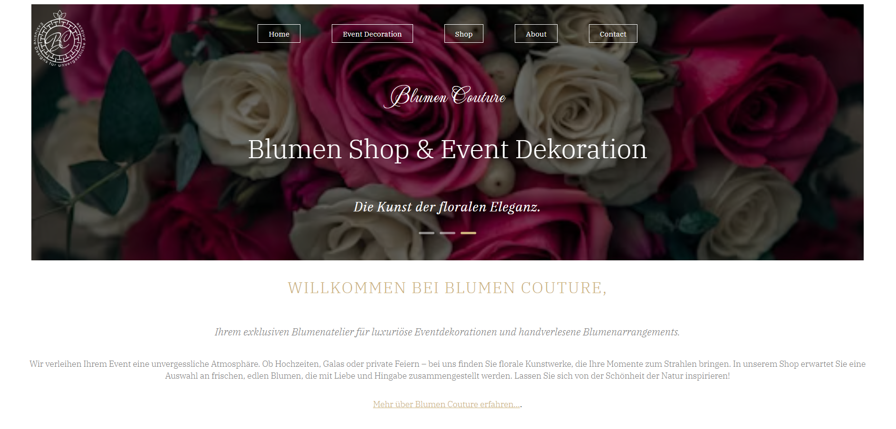

# Blumen Couture

**Blumen Couture** ist eine Webanwendung, die sich auf florale Eventdekorationen und exklusive Blumenarrangements spezialisiert. Die Website bietet eine ansprechende Benutzeroberfläche mit beeindruckenden Animationen und einer Vielzahl von Funktionen wie einem Warenkorbsystem, Tabs zur Präsentation von Stilen und einer API-Integration.

## 🚀 Demo

Erlebe Blumen Couture live: [https://blumen-couture-serenityscript.netlify.app/](https://blumen-couture-serenityscript.netlify.app/)

## 📋 Features

- **Luxuriöses Webdesign**: Visuell ansprechende Benutzeroberfläche mit **GSAP-Animationen**.
- **Warenkorb-System**: Benutzer können Produkte hinzufügen, sehen die Anzahl der Artikel und können im Warenkorb navigieren.
- **Interaktive Tabs**: Entdecken Sie verschiedene florale Dekorationsstile.
- **API-Integration**:
  - **Quotes API** für inspirierende Zitate.
  - **Unsplash API** für dynamische Bilder.
- **Responsive Design**: Passt sich nahtlos an alle Geräte an, von Desktops bis zu mobilen Bildschirmen.

## 🛠️ Technologien

- **React** (Hooks: useState, useEffect, useRef)
- **React Router** für Navigation zwischen Seiten.
- **GSAP** für Animationen.
- **CSS** mit Flexbox und Media Queries für responsives Design.
- **Quotes API** für Zitate.
- **Unsplash API** für Bilder.
- **SweetAlert2** für Benachrichtigungen

## 📦 Installation

1. **Repository klonen**:

  - git clone git clone https://github.com/SerenityScript/blumen-couture.git
  - cd blumen-couture

## Abhängigkeiten installieren:

Stelle sicher, dass Node.js und npm installiert sind. Führe dann folgenden Befehl aus:

npm install

App starten:

npm start
Die App wird normalerweise unter http://localhost:3000/ im Browser geöffnet.

## ⚙️ Verwendung

1. Entdecken Sie die Homepage:

- Begrüßung und Einführung in die Eventdekorationen.
- Countdown für Sonderaktionen.

2. Navigieren Sie durch Tabs:

- Wählen Sie aus verschiedenen floralen Stilen.

3. Warenkorb:

- Fügen Sie Artikel hinzu und überprüfen Sie den Warenkorb.

4. Inspirierende Zitate:

- Lassen Sie sich von der Quotes API inspirieren.

5. Dynamische Inhalte:

- Genießen Sie hochwertige Bilder von der Unsplash API.

## 📱 Responsives Design
Die App passt sich an verschiedene Bildschirmgrößen an und unterstützt sowohl mobile Geräte als auch Desktop-Bildschirme. Es wurden Flexbox und Media Queries verwendet, um sicherzustellen, dass die App auf unterschiedlichen Geräten optimal aussieht.

## 📄 Lizenz
Dieses Projekt ist unter der MIT License lizenziert. Siehe die LICENSE-Datei für weitere Details.

## 🔗 Nützliche Links

* React: https://reactjs.org/
* Create React App: https://create-react-app.dev/
* SweetAlert2 Dokumentation: https://sweetalert2.github.io/#usage/

## ✨ Mitwirkende

Yulia Siebrandt - Projektentwicklung

## 📧 Kontakt

Wenn du Fragen oder Vorschläge hast, melde dich gerne bei mir über [siebrandt.dev@gmail.com](mailto:siebrandt.dev@gmail.com)
